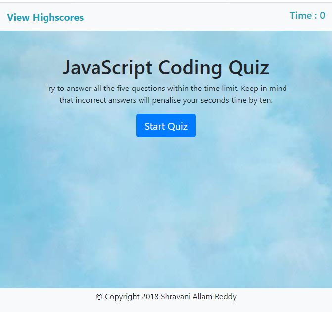

# Web-API Timed Code-Quiz 

## Description

Code Quiz with multiple-choice questions which is timer based and if you answer incorrectly, 10seconds of time is subtracted from the clock and score is the time left in seceonds when you finished the quiz.

## Usage

1. When you click the start button,
   * Timer starts, Questions are presented one by one,when you answer a question incorrectly, then 10 seconds of time is subtracted from the clock.

2. When all questions are answered or the timer reaches 0,
   * Then the game is over and scores page is presented with final score which is seconds left when you answer all the questions and also asks to store your initials.

3. When you click the submit button on Scores page, your initials and score are stored in local storage and Highscores page is displayed with stored initials and score.

4. There are options to play again and clear the highscores.
   * When you click on play again button,the game restarts and it appends all the scores if you play again.
   * When you click on clear button,all the scores will be deleted from the local storge and on page.

## Sources referred 

1. JSON Stringify: converts object to string 

    https://developer.mozilla.org/en-US/docs/Web/JavaScript/Reference/Global_Objects/JSON

2. To store the currentuser and score values
 
    https://developer.mozilla.org/en-US/docs/Web/API/Window/localStorage

    localStorage is similar to sessionStorage, except that while data stored in localStorage has no expiration time, data stored in sessionStorage gets cleared when the page session ends — that is, when the page is closed.

3. To restart the quiz 

    https://www.w3schools.com/js/js_window_location.asp

    window.location.href = "index.html";

 

